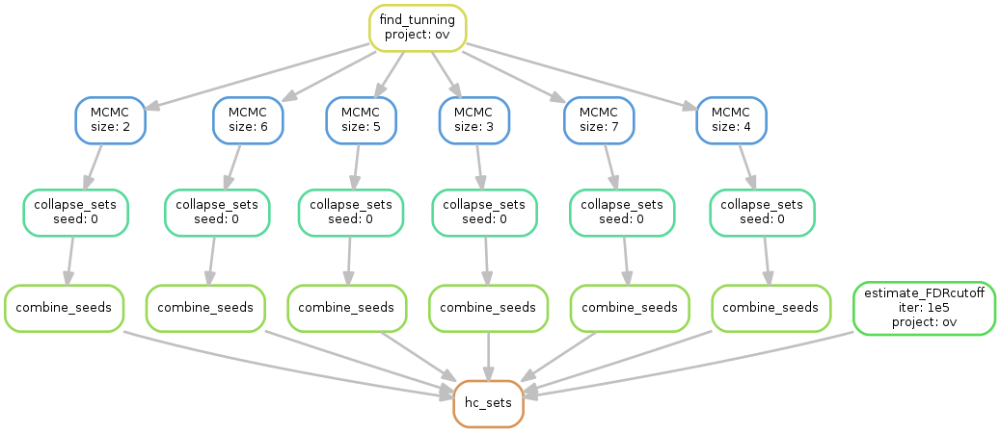

# MEScan
MEScan is an accurate and efficient statistical framework for genome-scale mutual exclusivity analysis of cancer mutations.

## Install from github

Install `devtools`
```
install.packages("devtools")
```

Install `MEScan` using the github repository
```
library(devtools)
install_github("markeybbsrf/mescan")
```

# Large scale ME patterns survey
We provide an example dataset from TCGA Ovarian Cancer to demonstrate the pipeline for large scale ME patterns survey using MEScan. 



Dependencies:
  * R:
    1. MEScan
    2. locfdr
    3. snowfall
  * Snakemake

Execuate the following code to executate the pipeline. 
```
cd mcmc
snakemake -s snake_me/Snakefile -p re/ov/ov.hc_sets.txt
```


## Prepare Input
We adapted the methods published in [MADGIC] (https://www.biostat.wisc.edu/kendzior/MADGiC/) package to generate the input for MEScan. Please follow the example provided in [example/prep_input](https://github.com/MarkeyBBSRF/MEScan/tree/master/example#how-to-generate-mescan-input).


## Reference
Korthauer, K.D., Kendziorski, C.: Madgic: a model-based approach for identifying driver genes in cancer.
Bioinformatics, 858 (2015)
