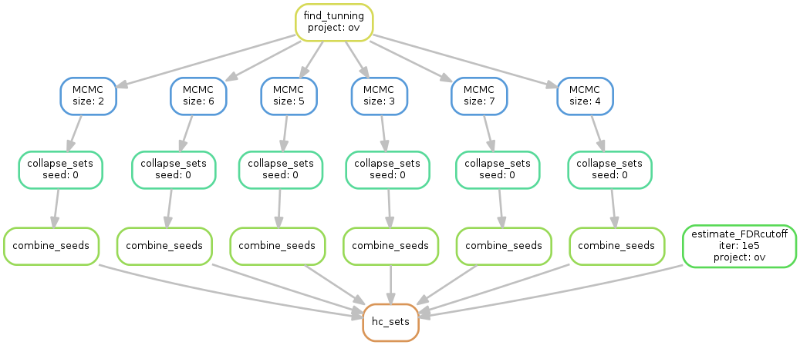

# MEScan for large scale ME patterns survey
We provide an example dataset from TCGA Ovarian Cancer to demonstrate the pipeline for large scale ME patterns survey using MEScan. 



Dependencies:
  * R:
    1. MEScan
    2. locfdr
    3. snowfall
  * Snakemake

Execuate the following code to executate the pipeline. 
```
cd mcmc
snakemake -s snake_me/Snakefile -p re/ov/ov.hc_sets.txt
```

# MEScan input
MEScan requires two input tables, one is a mutation table and the other is a background mutation rate table. The two tables can be generated using the `create_mescan_input.R` script from a given MAF file. The `create_mescan_input.R` script requires the R package `MADGiC`, which can be downloaded from [here](link_to_madgic). The downloaded `MADGiC` folder contains the following files:
```
# MADGiC functions
MADGiC.R
# MADGiC input data
exome_36.RData
gene.rep.expr.RData
gene_names.txt
prior.RData
```
Run `create_mescan_input.R` using the folloiwng script

```
Rscript create_mescan_input.R demo/mutationtable.Rdata demo_output
```

It will take some time to run the input preparation pipeline.

# MEScan output

A list of high-confidence mutually exclusive gene sets will be returned.
